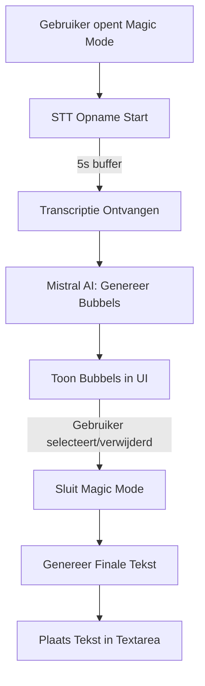
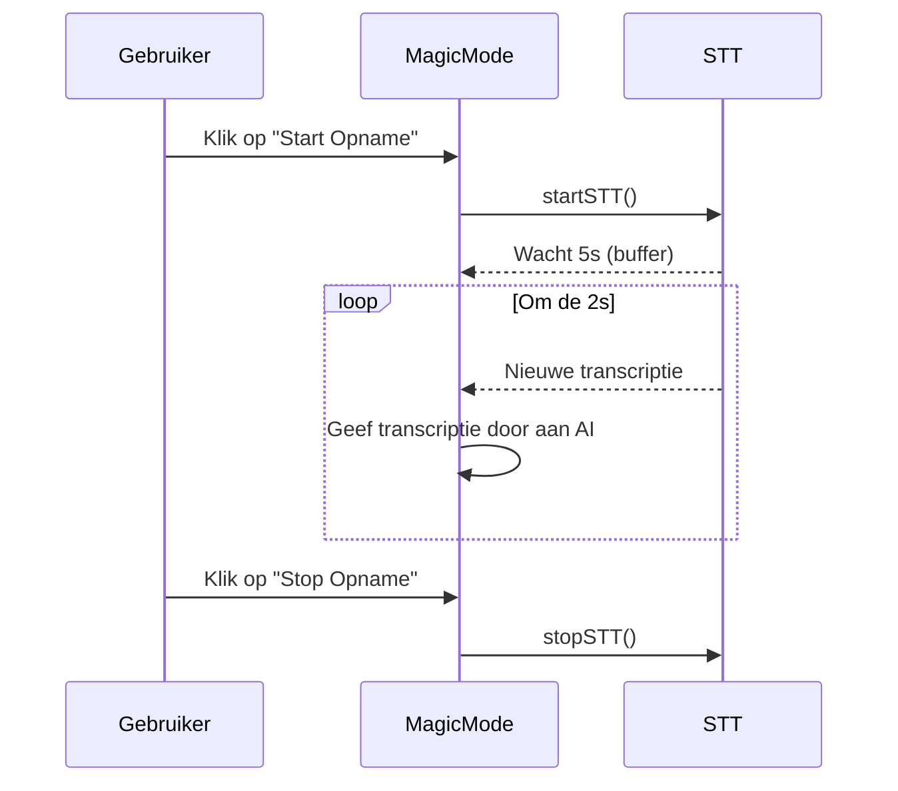
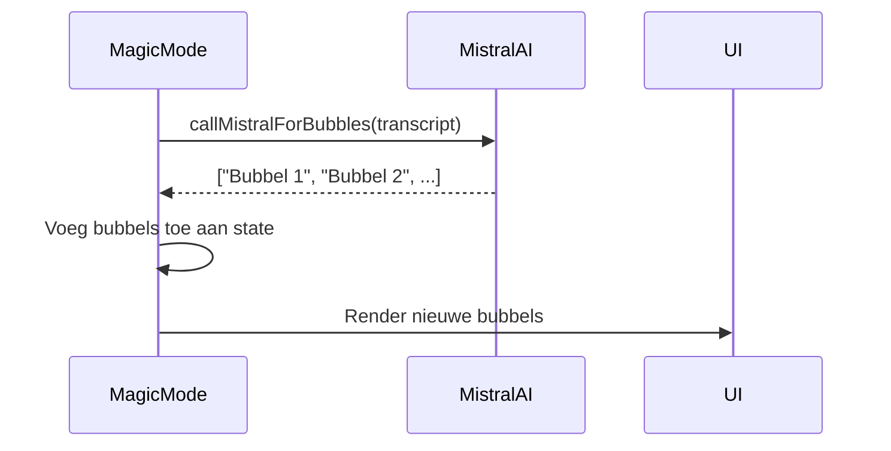

```markdown
# 🎤 Magic Mode - Documentatie

**Magic Mode** is een **interactieve, spraakgestuurde interface** voor open vragen in surveys, ontworpen om gebruikers een **natuurlijke en intuïtieve** manier te bieden om antwoorden te geven. Gebruikers kunnen **spreken** in plaats van typen, waarna AI-gegenereerde **bubbels** met korte tekstfragmenten verschijnen. Deze bubbels kunnen worden **geselecteerd of verwijderd**, waarna een **finale tekst** wordt gegenereerd en in de textarea wordt geplaatst.

---
## 🖼 Visuele Weergave

### Stroomdiagram


*Stroomdiagram: Van spraakopname tot finale tekstgeneratie.*

---

### UI Mockup


**Onderdelen**:
1. **Vraagtekst** (bovenaan, statisch).
2. **Bubbel-container** (centraal, scrollbaar, met animaties voor nieuwe bubbels).
3. **Microfoonknop** (centraal onderaan, statisch, met volume-animatie tijdens opname).
4. **Sluitknop** (rechts onderaan, klein maar zichtbaar).

---
## 📋 Algemene Richtlijnen

### 📌 Code Stijl
- **Hergebruik bestaande componenten**:
    - Knoppen, animaties en theming moeten **consistent** zijn met de rest van de app.
    - Importeer bestaande componenten (bijv. `PrimaryButton`) waar mogelijk.
- **Gebruik theme variabelen**:
  ```css
  .bubble {
    background-color: var(--theme-secondary);
    color: var(--theme-text);
    border-radius: var(--theme-border-radius);
    animation: fadeIn var(--theme-animation-duration);
  }
  ```
- **Vermijd duplicatie**:
    - Hergebruik **bestaande STT-logica** en **state management** waar mogelijk.

### 🧩 Modulariteit
Elk onderdeel (STT, AI, UI, state) moet:
- **Afzonderlijk testbaar** zijn (met mocks voor externe services).
- **Duidelijk gedocumenteerd** zijn in de bijbehorende `phaseX.md`.

### 🧪 Teststrategie
- **Mock externe services**:
    - Gebruik **mock STT** en **mock Mistral AI** tijdens ontwikkeling.
    - Voorbeeld mock voor STT:
      ```typescript
      // magicMode/__mocks__/sttService.ts
      export function startSTT(callback: (transcript: string) => void) {
        setTimeout(() => callback("Dit is een test transcriptie."), 1000);
      }
      ```
- **Unit tests**:
    - Test **logica** (bijv. state management, AI-service) met Jest.
- **UI-tests**:
    - Test **componenten** (bijv. `Bubble`, `BubbleContainer`) met React Testing Library.

### ✅ Integratie
- Magic Mode moet **naadloos** integreren met de bestaande survey-pagina:
    - Voeg een **toggle-knop** toe om Magic Mode te starten/stoppen.
    - Zorg dat de **finale tekst** correct in de textarea wordt geplaatst.

---

In deze tabel staan de locaties enkel in UI-MVC. Waar mogelijk is mogen onderdelen in andere delen staan zoals BL - DAL - DOMAIN(niet aangeraden).

| Onderdeel | Technologie | Locatie in Project | Verantwoordelijkheid |
| --- | --- | --- | --- |
| Frontend | Razor Views (.cshtml) | UI-MVC/Views/ | UI-componenten (bubbels, knoppen) in Razor-syntaxis. |
| Backend Logica | C# (ASP.NET Core MVC) | UI-MVC/Controllers/ | Controllers voor Magic Mode (bijv. MagicModeController.cs). |
| Models | C# Klassen | UI-MVC/Models/ | Data-modellen voor bubbels, transcripties (bijv. BubbleModel.cs). |
| Views | Razor Pages | UI-MVC/Views/MagicMode/ | Views voor Magic Mode (bijv. Index.cshtml, _BubblePartial.cshtml). |
| STT Service | C# + Voxtrall API | UI-MVC/Services/SttService.cs | Spraakopname en transcriptie (hergebruik bestaande STT-logica). |
| AI Service | C# + Mistral AI SDK | UI-MVC/Services/AiService.cs | Mistral AI-integratie voor bubbelgeneratie (key_phrases). |
| Styling | CSS + Theme Variabelen | UI-MVC/wwwroot/css/magic-mode/ | Stijlen voor bubbels, knoppen, animaties (gebruik site.css of aparte CSS-bestanden). |
| Client-Side Scripts | JavaScript/TypeScript | UI-MVC/wwwroot/js/magic-mode/ | Client-side logica voor animaties, interacties (bijv. magicMode.js). |
| State Management | C# ViewModels + JavaScript | UI-MVC/Models/ViewModels/ + Client-Side | Beheer van bubbels en finale tekst (combinatie van server-side en client-side). |
| Dependencies | NuGet Packages | UI-MVC/Dependencies/ | Externe packages (bijv. MistralAI.SDK, Voxtrall.STT). |
| Configuratie | appsettings.json | UI-MVC/appsettings.Development.json | API-keys voor Mistral AI en Voxtrall. |

---

## 📂 Fases en Volgorde

Magic Mode wordt gebouwd in **7 fasen**. Elk fase-bestand (`phases/phaseX.md`) bevat **gedetailleerde stappen**, **codevoorbeelden** en **testinstructies**.

| Fase | Bestandsnaam          | Doel                                  | Status      |
|------|-----------------------|---------------------------------------|-------------|
| 1    | [phase1-setup.md](phases/phase1-setup.md) | Projectstructuur en afhankelijkheden | ⚠ Todo      |
| 2    | [phase2-stt.md](phases/phase2-stt.md)     | STT-integratie                        | ⚠ Todo      |
| 3    | [phase3-ai.md](phases/phase3-ai.md)       | Mistral AI-integratie                 | ⚠ Todo      |
| 4    | [phase4-ui.md](phases/phase4-ui.md)       | UI-componenten                        | ⚠ Todo      |
| 5    | [phase5-state.md](phases/phase5-state.md) | State management                      | ⚠ Todo      |
| 6    | [phase6-integration.md](phases/phase6-integration.md) | Integratie met survey-pagina | ⚠ Todo      |
| 7    | [phase7-testing.md](phases/phase7-testing.md) | Eindtest en optimalisatie            | ⚠ Todo      |

---
## 📊 Stroomdiagrammen

### STT Flow


*STT-flow: Opname → buffer → periodieke transcripties.*

---

### AI Flow


*AI-flow: Transcriptie → bubbels → UI-update.*

---
## 🚀 Voorbeelden

1. **Vraagtekst**: Statisch, bovenaan (bijv. *"Vertel ons over je ervaring..."*).
2. **Bubbel-container**:
    - **Grid-lay-out** (2-3 bubbels per rij).
    - **Scrollbaar** als er te veel bubbels zijn.
    - **Animatie**: Nieuwe bubbels "vliegen" binnen met `fade-in`.
3. **Microfoonknop**:
    - **Pulse-animatie** tijdens opname.
    - Tekst wisselt tussen *"🎤 Opnemen"* en *"⏸ Pauzeer"*.
4. **Sluitknop**: Klein, rechts onderaan (tekst: *"Sluiten"*).

---

### Voorbeeld: Bubbel-Animatie
```css
@keyframes fadeIn {
  from { opacity: 0; transform: translateY(10px); }
  to { opacity: 1; transform: translateY(0); }
}

.bubble {
  animation: fadeIn 0.3s ease-out;
}
```

---
## 📋 Algemene Workflow

1. **Gebruiker start Magic Mode**:
    - Klikt op de **"Magic Mode"**-knop in de survey.
    - De **microfoonknop** verschijnt centraal onderaan.

2. **Spraakopname**:
    - Gebruiker klikt op de microfoonknop → opname start.
    - **Volume-animatie** rond de knop (golfjes die meebewegen met de stem).
    - Na **5 seconden** wordt de eerste transcriptie gegenereerd en doorgestuurd naar Mistral AI.

3. **Bubbelgeneratie**:
    - Mistral AI retourneert **3-5 korte tekstfragmenten** (bubbels).
    - Bubbels verschijnen in de container met een **fade-in animatie**.

4. **Interactie**:
    - Gebruiker kan bubbels **selecteren** (klik om te markeren) of **verwijderen** (klik op "X").
    - Nieuwe transcripties voegen **extra bubbels** toe.

5. **Afsluiten**:
    - Gebruiker klikt op **"Sluiten"**.
    - Overgebleven bubbels worden **samengevoegd** tot een tekst.
    - Tekst wordt in de **textarea** geplaatst.

---
## ⚠ Veelvoorkomende Problemen en Oplossingen

| Probleem                          | Oplossing                                                                 |
|-----------------------------------|---------------------------------------------------------------------------|
| **STT is traag bij starten**      | Gebruik een **loading indicator** (bijv. "Even geduld...") tijdens de eerste 5 seconden. |
| **Bubbels overlappen**            | Pas de `grid-template-columns` aan in `.bubble-container` (bijv. `minmax(120px, 1fr)`). |
| **AI retourneert lege bubbels**   | Voeg een **fallback** toe: als geen bubbels, toon dan de originele transcriptie als één bubbel. |
| **Animaties werken niet**         | Controleer of `var(--theme-animation-duration)` correct is gedefinieerd in `:root`. |
| **Microfoonknop reageert niet**   | Zorg dat `startSTT` en `stopSTT` correct zijn geïmporteerd en aangeroepen. |

---
## 📌 Changelog

| Datum       | Wijziging                                  | Door       |
|-------------|--------------------------------------------|------------|
| 2026-04-26  | Initiële documentatie structuur aangemaakt | Matéo Rohr |
| 2026-04-26  | Stroomdiagrammen toegevoegd               | Matéo Rohr |
| 2026-04-26  | UI-mockups en voorbeelden toegevoegd      | Matéo Rohr |

---
```