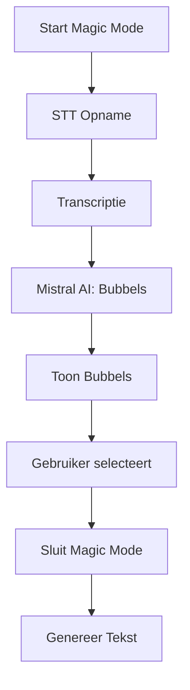

Hier is de **complete filestructuur** voor de documentatie van **Magic Mode**, inclusief **bestandsnamen**, **inhoudsopgave** en **voorbeelden** van wat in elk bestand moet staan. Deze structuur is **klaar om direct te gebruiken** en sluit naadloos aan bij jullie **Mistral Vibe**-aanpak (modulair, herbruikbaar, onderhoudbaar).

---

### **📁 Documentatiestructuur**
```
magicMode/
├── README.md                  # Hoofddocumentatie (overzicht, doel, stroomdiagram, algemene richtlijnen)
├── phases/
│   ├── phase1-setup.md        # Fase 1: Projectstructuur en afhankelijkheden
│   ├── phase2-stt.md          # Fase 2: STT-integratie
│   ├── phase3-ai.md           # Fase 3: Mistral AI-integratie
│   ├── phase4-ui.md           # Fase 4: UI-componenten
│   ├── phase5-state.md        # Fase 5: State management
│   ├── phase6-integration.md  # Fase 6: Integratie met survey-pagina
│   └── phase7-testing.md       # Fase 7: Eindtest en optimalisatie
├── assets/
│   ├── magic-mode-flow.png    # Stroomdiagram (bijv. Mermaid.js export)
│   ├── ui-mockup.png          # Visuele mockup van de UI
│   ├── stt-diagram.png        # STT-flow diagram
│   └── ai-flow.png            # Mistral AI-integratie diagram
├── examples/
│   ├── stt-service.ts         # Voorbeeldcode: STT-integratie
│   ├── bubble-component.tsx   # Voorbeeldcode: Bubbel-UI
│   ├── ai-service.ts          # Voorbeeldcode: Mistral AI-integratie
│   └── state-manager.ts       # Voorbeeldcode: State management
└── templates/
    ├── phase-template.md      # Sjabloon voor nieuwe fase-documenten
    └── component-template.md  # Sjabloon voor component-documentatie
```

---

---

## **📄 Inhoud per Bestand**
Hieronder vind je **wat in elk bestand moet staan**, inclusief **voorbeelden** en **sjablonen**.

---

### **1. `README.md` (Hoofddocument)**
```markdown
# 🎤 Magic Mode - Documentatie

## 📌 Overzicht
Magic Mode is een **interactieve spraakgestuurde interface** voor open vragen in surveys. Gebruikers kunnen:
- **Spreken** in plaats van typen.
- **AI-gegenereerde bubbels** selecteren/verwijderen.
- Een **finale tekst** genereren gebaseerd op geselecteerde bubbels.

### 🖼 Visuele Weergave

*Stroomdiagram: Van spraakopname tot finale tekst.*


*Visuele mockup van de Magic Mode interface.*

---

## 📋 Algemene Richtlijnen
### Code Stijl
- **Hergebruik bestaande componenten** (knoppen, animaties, theming).
- **Gebruik theme variabelen** voor kleuren, animaties en afmetingen:
  ```css
  .bubble {
    background-color: var(--theme-secondary);
    animation: fadeIn var(--theme-animation-duration);
  }
  ```
- **Vermijd duplicatie**: Importeer bestaande logica (bijv. STT, theming).

### Modulariteit
Elk onderdeel (STT, AI, UI, state) moet:
- **Afzonderlijk testbaar** zijn.
- **Duidelijk gedocumenteerd** zijn in de bijbehorende `phaseX.md`.

### Teststrategie
- **Mock externe services** (STT, Mistral AI) tijdens ontwikkeling.
- Schrijf **unit tests** voor logica en **UI-tests** voor componenten.

---

## 🛠 Technische Stack
| Onderdeel       | Technologie               | Locatie                     |
|-----------------|---------------------------|-----------------------------|
| Frontend        | React/Vue                 | `src/magicMode/ui/`         |
| STT             | Voxtrall (bestaand)       | `src/magicMode/services/sttService.ts` |
| AI              | Mistral AI (`key_phrases`) | `src/magicMode/services/aiService.ts` |
| Styling         | CSS (theme variabelen)    | `src/magicMode/styles/`     |
| State Management| Lokale state              | `src/magicMode/state/`      |

---

## 📂 Fases en Volgorde
Magic Mode wordt gebouwd in **7 fasen**. Raadpleeg de bijbehorende `phases/phaseX.md` voor details.

| Fase | Bestandsnaam          | Doel                                  |
|------|-----------------------|---------------------------------------|
| 1    | phase1-setup.md       | Projectstructuur en afhankelijkheden |
| 2    | phase2-stt.md         | STT-integratie                        |
| 3    | phase3-ai.md          | Mistral AI-integratie                 |
| 4    | phase4-ui.md          | UI-componenten                        |
| 5    | phase5-state.md       | State management                      |
| 6    | phase6-integration.md | Integratie met survey-pagina          |
| 7    | phase7-testing.md     | Eindtest en optimalisatie             |

---

## 📊 Stroomdiagram


---

## 🚀 Mockups
### UI Mockup

- **Microfoonknop**: Centraal onderaan, statisch.
- **Bubbel-container**: Scrollbaar, animaties bij nieuwe bubbels.
- **Sluitknop**: Rechts onderaan.

### STT Flow

*5s buffer → transcriptie om de 2s → doorgeven aan AI.*

---
```

---

### **2. `phases/phase1-setup.md` (Fase 1: Projectstructuur)**
```markdown
# Fase 1: Projectstructuur en Afhankelijkheden

## 📌 Doel
Aanmaken van de **basisstructuur** voor Magic Mode, inclusief:
- Mappen voor code, documentatie en assets.
- Installatie van benodigde afhankelijkheden.
- Hergebruik van bestaande theme variabelen.

---

## 🛠 Stappen

### 1. Maak de projectstructuur
```bash
mkdir -p magicMode/{ui,services,state,styles,tests,assets,examples}
touch magicMode/README.md
```

### 2. Installeer afhankelijkheden
```bash
npm install @mistralai/mistralai  # Voor Mistral AI-integratie
```

### 3. Hergebruik bestaande theming
- Kopieer **theme variabelen** (kleuren, animaties) uit de hoofdapp naar `magicMode/styles/index.css`:
  ```css
  :root {
    --bubble-bg: var(--theme-secondary);
    --animation-duration: var(--theme-animation-duration);
  }
  ```

### 4. Voeg sjablonen toe
- Kopieer de sjablonen uit `templates/` naar de juiste mappen (bijv. `phase-template.md` voor nieuwe fasen).

---

## 🧪 Testinstructies
- Controleer of:
    - De mappen correct zijn aangemaakt.
    - Afhankelijkheden geïnstalleerd zijn (`npm list @mistralai/mistralai`).
    - Theme variabelen correct zijn gekopieerd.

---

## ⚠ Veelvoorkomende Problemen
**Probleem**: *"Afhankelijkheden installeren mislukt."*
**Oplossing**: Controleer of je in de juiste directory bent (`cd magicMode`) en voer `npm install` uit.

---
```

---

### **3. `phases/phase4-ui.md` (Fase 4: UI-Componenten)**
```markdown
# Fase 4: UI-Componenten

## 📌 Doel
Bouwen van de **visuele componenten** voor Magic Mode:
- `Bubble`: Een enkele bubbel met tekst en verwijderknop.
- `BubbleContainer`: Container voor alle bubbels (scrollbaar, grid-lay-out).
- `MicrophoneButton`: Microfoon/pauze-knop met animatie.
- `CloseButton`: Sluitknop voor Magic Mode.

---
## 🛠 Stappen

### 1. Maak de `Bubble`-component
- Locatie: `magicMode/ui/Bubble.tsx`
- Gebruik **theme variabelen** voor stijlen.
- Voeg een `fade-in` animatie toe.

**Codevoorbeeld**:
```tsx
interface BubbleProps {
  text: string;
  onRemove: () => void;
}

export function Bubble({ text, onRemove }: BubbleProps) {
  return (
    <div className="bubble">
      <p>{text}</p>
      <button onClick={onRemove} aria-label="Verwijder bubbel">X</button>
    </div>
  );
}
```

**CSS**:
```css
.bubble {
  background-color: var(--bubble-bg);
  animation: fadeIn var(--animation-duration);
  border-radius: var(--theme-border-radius);
}

@keyframes fadeIn {
  from { opacity: 0; transform: translateY(10px); }
  to { opacity: 1; transform: translateY(0); }
}
```

---

### 2. Maak de `BubbleContainer`
- Locatie: `magicMode/ui/BubbleContainer.tsx`
- Gebruik **CSS Grid** voor de lay-out.
- Voeg `overflow-y: auto` toe voor scrollen.

**Codevoorbeeld**:
```tsx
interface BubbleContainerProps {
  bubbles: string[];
  onRemoveBubble: (index: number) => void;
}

export function BubbleContainer({ bubbles, onRemoveBubble }: BubbleContainerProps) {
  return (
    <div className="bubble-container">
      {bubbles.map((text, index) => (
        <Bubble
          key={index}
          text={text}
          onRemove={() => onRemoveBubble(index)}
        />
      ))}
    </div>
  );
}
```

**CSS**:
```css
.bubble-container {
  display: grid;
  grid-template-columns: repeat(auto-fill, minmax(150px, 1fr));
  gap: 10px;
  max-height: 60vh;
  overflow-y: auto;
  padding: 10px;
}
```

---

### 3. Maak de `MicrophoneButton` en `CloseButton`
- Locatie: `magicMode/ui/MicrophoneButton.tsx` en `magicMode/ui/CloseButton.tsx`.
- Gebruik **bestaande knopcomponenten** uit de hoofdapp (indien beschikbaar).
- Voeg een **pulserende animatie** toe voor de microfoonknop tijdens opname.

**MicrophoneButton.tsx**:
```tsx
interface MicrophoneButtonProps {
  isRecording: boolean;
  onToggle: () => void;
}

export function MicrophoneButton({ isRecording, onToggle }: MicrophoneButtonProps) {
  return (
    <button
      className={`microphone-button ${isRecording ? 'recording' : ''}`}
      onClick={onToggle}
      aria-label={isRecording ? "Stop opname" : "Start opname"}
    >
      {isRecording ? "🎤 Pauzeer" : "🎤 Opnemen"}
    </button>
  );
}
```

**CSS**:
```css
.microphone-button {
  background-color: var(--theme-primary);
  animation: pulse 1.5s infinite;
}

.microphone-button.recording {
  background-color: var(--theme-error);
}

@keyframes pulse {
  0% { transform: scale(1); }
  50% { transform: scale(1.1); }
  100% { transform: scale(1); }
}
```

---

## 🧪 Testinstructies
1. **Handmatige test**:
    - Render de componenten in een testpagina (bijv. `magicMode/tests/UITestPage.tsx`).
    - Controleer visueel:
        - Of bubbels correct renderen en animeren.
        - Of de microfoonknop pulseert tijdens "opname".
        - Of de container scrollt bij >5 bubbels.

2. **Automatische test (optioneel)**:
    - Gebruik **React Testing Library** om te testen of componenten renderen:
      ```tsx
      import { render, screen } from '@testing-library/react';
      import { Bubble } from '../ui/Bubble';
 
      test('Bubble rendert tekst en verwijderknop', () => {
        render(<Bubble text="Test" onRemove={() => {}} />);
        expect(screen.getByText("Test")).toBeInTheDocument();
        expect(screen.getByText("X")).toBeInTheDocument();
      });
      ```

---

## ⚠ Veelvoorkomende Problemen
**Probleem**: *"Bubbels overlappen elkaar."*
**Oplossing**: Pas de `grid-template-columns` aan in `.bubble-container` (bijv. `minmax(120px, 1fr)`).

**Probleem**: *"Animaties werken niet."*
**Oplossing**: Controleer of `var(--animation-duration)` correct is gedefinieerd in `:root`.

---
```

---

### **4. `templates/phase-template.md` (Sjabloon voor Nieuwe Fases)**
```markdown
# Fase X: [Fasenaam]

## 📌 Doel
[Korte beschrijving van het doel van deze fase.]

---

## 🛠 Stappen

### 1. [Stap 1]
[Beschrijving + codevoorbeeld]

### 2. [Stap 2]
[Beschrijving + codevoorbeeld]

---

## 🧪 Testinstructies
[Hoe deze fase te testen: handmatig/automatisch.]

---

## ⚠ Veelvoorkomende Problemen
**Probleem**: *"[Probleembeschrijving]."*
**Oplossing**: *"[Oplossing]."*
```

---

---

## **💡 Tips voor Onderhoud**
1. **Gebruik Mermaid.js voor diagrammen**:
    - Voeg stroomdiagrammen toe aan je `README.md` met:
      ```markdown
      ```mermaid
      graph TD
        A[Start] --> B[STT]
        B --> C[AI]
      ```
      ```
    - Exporteer diagrammen als PNG en plaats ze in `assets/`.

2. **Houd documentatie up-to-date**:
    - Werk de `phaseX.md`-bestanden bij **tijdens** de implementatie (niet achteraf).

3. **Gebruik sjablonen**:
    - Kopieer `templates/phase-template.md` voor nieuwe fasen.

4. **Voeg changelogs toe**:
    - Voeg aan het einde van elk `phaseX.md`-bestand een **changelog** toe:
      ```markdown
      ## Changelog
      - 2026-04-26: Toegevoegd foutafhandeling voor STT-timeouts.
      ```

---

## **📥 Hoe te Beginnen?**
1. **Maak de mappenstructuur** aan zoals hierboven beschreven.
2. **Begin met `README.md`**:
    - Schrijf het **hoofddoel**, voeg een **stroomdiagram** toe (met Mermaid) en beschrijf de **algemene richtlijnen**.
3. **Vul `phase1-setup.md`** in en volg de stappen om de basisstructuur te maken.
4. **Gebruik de sjablonen** voor nieuwe fasen.

---
### **❓ Vragen?**
- Wil je dat ik een **concreet voorbeeld** uitwerk voor een ander `phaseX.md`-bestand?
- Heb je **specifieke eisen** voor de inhoud van de documentatie?

Je kunt **direct aan de slag** met deze structuur! Laat me weten als je hulp nodig hebt bij een specifiek onderdeel. 😊